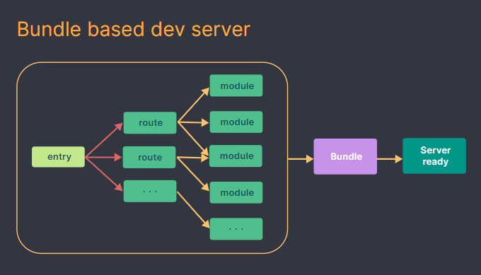

# SynapseED: Education Collaborative Platform

Welcome to SynapseED, an education collaborative platform designed to facilitate research sharing and collaboration among academics, researchers, and students.

## About the Project

- **Developer:** Tendai Terrence Machaya
- **Project:** Final Web Technology
- **Demo Video:** [Watch Demo Video](https://www.youtube.com/watch?v=zt1mN5SwIvQ)
- **Link to WebApp** [visit the website](http://16.16.90.16:8000/)

SynapseED aims to empower researchers, academics, and students by providing a platform to share research, collaborate on projects, and connect with like-minded individuals within the research community.

## Target Users

- **Researchers:** Submit, review, comment, and share research findings.
- **Students:** Access, upload, and download research papers and educational resources.
- **Professors and Academics:** Collaborate with peers and engage in research discussions.

## Key Features

- **Resource Sharing:** Users can upload, browse, and download educational resources. They can also rate and review resources.
- **Collaborative Research Spaces:** Join communities of researchers to collaborate and discuss projects.

## Technology Stack

- **Frontend:** Vite + React
- **Backend:** PHP serving APIs
- **Communication:** Frontend communicates with the backend via APIs.

## Project Structure and Architecture

One notable issue encountered during development was the absence of an `index.html` file in every folder, which prevented the successful build of the entire project into a `dist` folder. This impacted website performance due to slower page reloads.

### Project Architecture

The architecture diagram illustrates the React + Vite frontend setup communicating with the PHP backend via APIs.

For more details, refer to the provided demo video. Feel free to contact Tendai Terrence Machaya for additional information or inquiries about the project.
